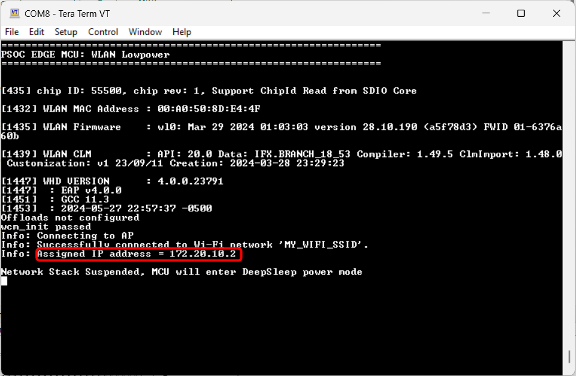
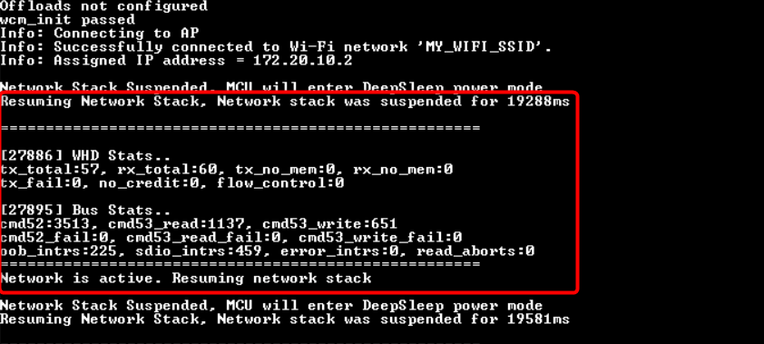
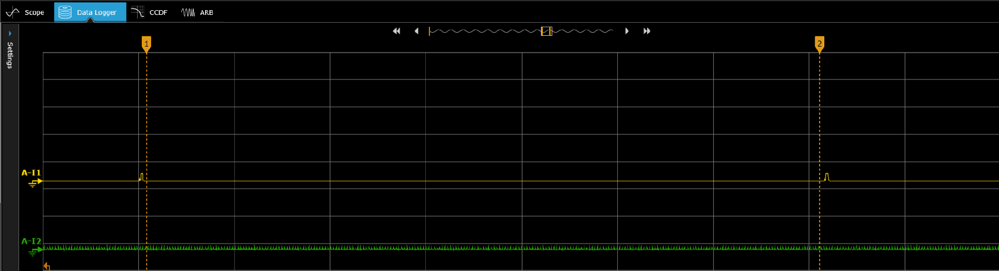
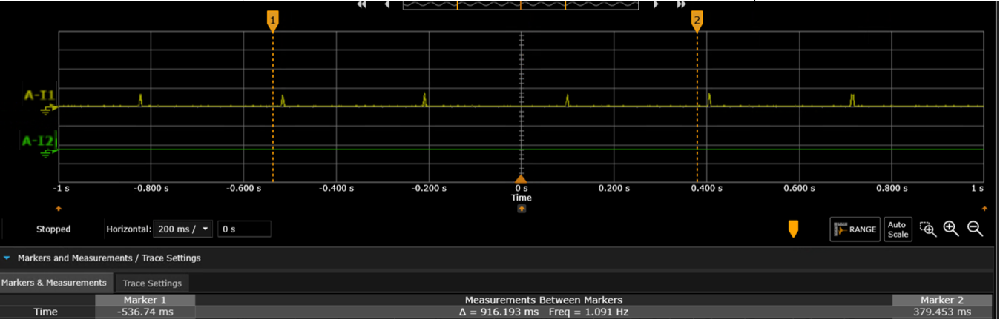

# PSOC&trade; Edge MCU: WLAN low power

This code example demonstrates the low-power operation of a host PSOC&trade; Edge E84 MCU and a WLAN AIROC&trade; CYW55513 Wi-Fi & Bluetooth&reg; combo chip using the network activity handlers provided by the low-power assistant (LPA) middleware.

The code example connects to a configured network. After connecting to the network successfully, it configures the WLAN device in a power-save mode, suspending the network stack to put the host MCU in wait state. During this wait state, the host MCU enters a low-power state, and wakes up when any network activity is detected on the MAC interface.

This code example has a three project structure: CM33 secure, CM33 non-secure, and CM55 projects. All three projects are programmed to the external QSPI flash and executed in Execute in Place (XIP) mode. Extended boot launches the CM33 secure project from a fixed location in the external flash, which then configures the protection settings and launches the CM33 non-secure application. Additionally, CM33 non-secure application enables CM55 CPU and launches the CM55 application.

[View this README on GitHub.](https://github.com/Infineon/mtb-example-psoc-edge-wlan-lowpower)

[Provide feedback on this code example.](https://cypress.co1.qualtrics.com/jfe/form/SV_1NTns53sK2yiljn?Q_EED=eyJVbmlxdWUgRG9jIElkIjoiQ0UyNDAwNjYiLCJTcGVjIE51bWJlciI6IjAwMi00MDA2NiIsIkRvYyBUaXRsZSI6IlBTT0MmdHJhZGU7IEVkZ2UgTUNVOiBXTEFOIGxvdyBwb3dlciIsInJpZCI6InN1cmVzaGt1bWFyYSIsIkRvYyB2ZXJzaW9uIjoiMi4wLjEiLCJEb2MgTGFuZ3VhZ2UiOiJFbmdsaXNoIiwiRG9jIERpdmlzaW9uIjoiTUNEIiwiRG9jIEJVIjoiSUNXIiwiRG9jIEZhbWlseSI6IlBTT0MifQ==)

See the [Design and implementation](docs/design_and_implementation.md) for the functional description of this code example.


## Requirements

- [ModusToolbox&trade;](https://www.infineon.com/modustoolbox) v3.6 or later (tested with v3.6)
- Board support package (BSP) minimum required version: 1.0.0
- Programming language: C
- Associated parts: All [PSOC&trade; Edge MCU](https://www.infineon.com/products/microcontroller/32-bit-psoc-arm-cortex/32-bit-psoc-edge-arm) parts


## Supported toolchains (make variable 'TOOLCHAIN')

- GNU Arm&reg; Embedded Compiler v14.2.1 (`GCC_ARM`) – Default value of `TOOLCHAIN`
- Arm&reg; Compiler v6.22 (`ARM`)
- IAR C/C++ Compiler v9.50.2 (`IAR`)
- LLVM Embedded Toolchain for Arm&reg; v19.1.5 (`LLVM_ARM`)


## Supported kits (make variable 'TARGET')

- [PSOC&trade; Edge E84 Evaluation Kit](https://www.infineon.com/KIT_PSE84_EVAL) (`KIT_PSE84_EVAL_EPC2`) – Default value of `TARGET`
- [PSOC&trade; Edge E84 Evaluation Kit](https://www.infineon.com/KIT_PSE84_EVAL) (`KIT_PSE84_EVAL_EPC4`)


## Hardware setup

This example uses the board's default configuration. See the kit user guide to ensure that the board is configured correctly.

Ensure the following jumper and pin configuration on board.
- BOOT SW must be in the HIGH/ON position
- J20 and J21 must be in the tristate/not connected (NC) position

Perform the hardware reworks mentioned in the [Measuring the current consumption](#measuring-the-current-consumption) section to measure the low-power currents.


## Software setup

See the [ModusToolbox&trade; tools package installation guide](https://www.infineon.com/ModusToolboxInstallguide) for information about installing and configuring the tools package.

Install a terminal emulator if you do not have one. Instructions in this document use [Tera Term](https://teratermproject.github.io/index-en.html).

Install [Nmap](https://nmap.org/download) utility if you do not have one. This is required to use nping command.

This example requires no additional software or tools.


## Operation

See [Using the code example](docs/using_the_code_example.md) for instructions on creating a project, opening it in various supported IDEs, and performing tasks, such as building, programming, and debugging the application within the respective IDEs.

1. Connect the board to your PC using the provided USB cable through the KitProg3 USB connector

2. Modify the `WIFI_SSID`, `WIFI_PASSWORD`, and `WIFI_SECURITY` macros to match the credentials of the Wi-Fi network that you want to connect to, which are defined in the *proj_cm33_ns/source/lowpower_task.h* file <br>

   **Note:** See the `cy_wcm_security_t` enumeration in *cy_wcm.h* file to pass the corresponding WCM security type in the `WIFI_SECURITY` macro 

3. Ensure that your PC is connected to the same Wi-Fi access point (AP) that you have configured in **Step 2**

4. Open a terminal program and select the KitProg3 COM port. Set the serial port parameters to 8N1 and 115200 baud

5. After programming, the application starts automatically. The example connects to the AP and suspends the network stack <br> 

   **Figure 1. Connected to AP and suspended the network stack**

    

6. Open the command prompt and ping the IP address displayed on the serial terminal:

   ```
   nping -tcp <IP address>
   ```

   The network stack resumes. The device displays the deep sleep and Wi-Fi SDIO bus statistics on the terminal. The USER LED1 on the kit is toggled after resuming the network stack after which the network stack is again suspended until network activity is detected

   **Figure 2. Resuming the network stack**

   

   > **Note:** The host MCU will wake up when any network activity is detected and not necessarily due to the `nping` from the PC. The reasons for network activity can be due to the broadcast or multicast packets issued by the AP. Further power saving can be implemented by using offload features like packet filtering, which will increase the time the host MCU will be in deep sleep.

   See the [PSOC&trade; Edge MCU: WLAN Offloads](https://github.com/Infineon/mtb-example-psoc-edge-wlan-offloads) code example for low-power offload features.

   See the [Measuring the current consumption](#measuring-the-current-consumption) section for instructions on how to measure the current consumed by the PSOC&trade; Edge E84 MCU and the Wi-Fi device.


## Measuring the current consumption

PSOC&trade; Edge E84 Evaluation Kit is a generic kit to evaluate the PSOC&trade; Edge MCU features. To particularly measure the current consumption for this code example, change the following on the hardware.

1. Perform the hardware reworks mentioned in the **Rework for PSOC&trade; Edge E84 MCU low power current measurement** section 3.3.16 of the [KIT_PSE84_EVAL PSOC&trade; Edge E84 Evaluation Kit guide](https://www.infineon.com/KIT_PSE84_EVAL_UG)
2. Remove R188 (680 ohm) on the PSOC&trade; Edge E84 system-on-module (SoM) to disable the connectivity power LED (D3) on the SoM <br>
3. Remove R90 (10k ohm) and populate R93 (4.7k ohm) on the PSOC&trade; Edge E84 SoM to disable the JTAG connected to CYW55513 module
4. Remove R415 (0 ohm) on the KIT_PSOCE84_EVK to measure the CYW55513 VBAT current across it


### Measuring current consumption values

1. Connect wires across J25 (VBAT.MCU) for VBAT current and J26 (MCU.1V8) for (VDDD + VDDIO) current on the PSOC&trade; Edge E84 Evaluation Kit's baseboard to a Power Analyzer to measure the current consumed by the PSOC&trade; Edge E84 MCU

2. Similarly, connect wires across R415 on PSOC&trade; Edge E84 Evaluation Kit's baseboard to a Power Analyzer to measure the current consumed by the CYW55513 connectivity module 

3. Program the kit by following the steps in the [Operation](#operation) section

4. Turn on the Power Analyzer to see the current consumption across the CYW55513 connectivity module and the PSOC&trade; Edge E84 MCU as shown in **Figure 3** <br> <br>  The spikes in the current across the CYW55513 connectivity module is due to the beacons sent by the AP. The interval and amplitude of this beacon will vary based on the DTIM value, beacon interval, and frequency set in the router's configuration

   **Figure 3. Sample Power Analyzer output**

   

   Note that in **Figure 3**, the yellow pulse represents the current consumed by the CYW55513 connectivity module and the green pulse represents the current consumed by the PSOC&trade; Edge E84 MCU

5. Measure the deep sleep current (with default router settings) between any two DTIM intervals in the CYW55513 module's current as shown in **Figure 4**

   **Figure 4. Measuring the deep sleep current**

   

6. Enter the router's configuration page and set DTIM = 1, beacon interval = 100, and 2.4 GHz frequency and measure the average current over 3 DTIM intervals as shown in **Figure 5**

   **Figure 5. Average current over 3 DTIM periods for AP (2.4 GHz) beacon interval of 100 and AP DTIM of 1**

   

7. Similarly, vary the DTIM to 3 and the frequency of the Wi-Fi router to 5 GHz and measure the current consumptions across CYW55513 connectivity module and PSOC&trade; Edge E84 MCU


## Typical current measurement values 

All measurements are made in the presence of external radio interference and not in an isolated environment with a single AP and kit. The average power consumption will vary between DTIM intervals. This is because of other activities in the Wi-Fi spectrum (2.4 GHz or 5 GHz) such as other Wi-Fi networks, Bluetooth&reg; (2.4 GHz), or Long-Term Evolution (LTE in 2.4 GHz) interference that increase the duration for which AIROC&trade; CYW55513 Wi-Fi & Bluetooth&reg; combo chip listens for DTIM packet from the AP. This type of activity increases the average power consumption. 

These power values are not optimized for low power. See the [PSOC™ Edge MCU: Power measurements](https://github.com/Infineon/mtb-example-psoc-edge-power-measurements) code example for MCU power optimization and [AN241681](https://www.infineon.com/AN241681) - Low-power system design with PSOC&trade; Edge MCU and AIROC&trade; Wi-Fi & Bluetooth&reg; combo chip for CYW55513 optimization techniques .

>**Note:** The power consumption of the PSOC&trade; Edge MCU is calculated using the formula ((VBAT current) x 3.3 V) + ((VDDD + VDDDIO) current x 1.8 V). Similarly, the power consumption of the CWY55513 is calculated as VBAT current x 3.3 V.

**Table 1. Typical current values for PSOC&trade; Edge E84 MCU and CYW55513 connectivity module**

State  | Device   | Power
-----------|------- | -------------
Sleep  | PSOC&trade; Edge E84 MCU <br> CYW55513 (VBAT)  | 1.063 mW <br> 179.685 uW
Average power over 3 DTIM periods for AP (2.4 GHz) beacon interval of 100 and AP DTIM of 1  | PSOC&trade; Edge E84 MCU <br> CYW55513 (VBAT) | 1.063 mW <br> 2.361 mW
Average power over 3 DTIM periods for AP (2.4 GHz) beacon interval of 100 and AP DTIM of 3 | PSOC&trade; Edge E84 MCU <br> CYW55513 (VBAT) | 1.063 mW <br> 836.781 uW
Average power over 3 DTIM periods for AP (5 GHz) beacon interval of 100 and AP DTIM of 1 | PSOC&trade; Edge E84 MCU <br> CYW55513 (VBAT) | 1.063 mW <br> 1.782 mW
Average power over 3 DTIM periods for AP (5 GHz) beacon interval of 100 and AP DTIM of 3 | PSOC&trade; Edge E84 MCU <br> CYW55513 (VBAT) | 1.063 mW <br> 726.792 uW

<br>


## Related resources

Resources  | Links
-----------|----------------------------------
Application notes  | [AN235935](https://www.infineon.com/AN235935) – Getting started with PSOC&trade; Edge E8 MCU on ModusToolbox&trade; software <br> [AN236697](https://www.infineon.com/AN236697) – Getting started with PSOC&trade; MCU and AIROC&trade; Connectivity devices 
Code examples  | [Using ModusToolbox&trade;](https://github.com/Infineon/Code-Examples-for-ModusToolbox-Software) on GitHub
Device documentation | [PSOC&trade; Edge MCU datasheets](https://www.infineon.com/products/microcontroller/32-bit-psoc-arm-cortex/32-bit-psoc-edge-arm#documents) <br> [PSOC&trade; Edge MCU reference manuals](https://www.infineon.com/products/microcontroller/32-bit-psoc-arm-cortex/32-bit-psoc-edge-arm#documents)
Development kits | Select your kits from the [Evaluation board finder](https://www.infineon.com/cms/en/design-support/finder-selection-tools/product-finder/evaluation-board)
Libraries  | [mtb-dsl-pse8xxgp](https://github.com/Infineon/mtb-dsl-pse8xxgp) – Device support library for PSE8XXGP <br> [retarget-io](https://github.com/Infineon/retarget-io) – Utility library to retarget STDIO messages to a UART port
Tools  | [ModusToolbox&trade;](https://www.infineon.com/modustoolbox) – ModusToolbox&trade; software is a collection of easy-to-use libraries and tools enabling rapid development with Infineon MCUs for applications ranging from wireless and cloud-connected systems, edge AI/ML, embedded sense and control, to wired USB connectivity using PSOC&trade; Industrial/IoT MCUs, AIROC&trade; Wi-Fi and Bluetooth&reg; connectivity devices, XMC&trade; Industrial MCUs, and EZ-USB&trade;/EZ-PD&trade; wired connectivity controllers. ModusToolbox&trade; incorporates a comprehensive set of BSPs, HAL, libraries, configuration tools, and provides support for industry-standard IDEs to fast-track your embedded application development

<br>


## Other resources

Infineon provides a wealth of data at [www.infineon.com](https://www.infineon.com) to help you select the right device, and quickly and effectively integrate it into your design.


## Document history

Document title: *CE240066* – *PSOC&trade; Edge MCU: WLAN low power*

 Version | Description of change
 ------- | ---------------------
 1.x.0   | New code example <br> Early access release
 2.0.0   | GitHub release
 2.0.1   | Updated README.md
<br>


All referenced product or service names and trademarks are the property of their respective owners.

The Bluetooth&reg; word mark and logos are registered trademarks owned by Bluetooth SIG, Inc., and any use of such marks by Infineon is under license.

PSOC&trade;, formerly known as PSoC&trade;, is a trademark of Infineon Technologies. Any references to PSoC&trade; in this document or others shall be deemed to refer to PSOC&trade;.

---------------------------------------------------------

© Cypress Semiconductor Corporation, 2023-2025. This document is the property of Cypress Semiconductor Corporation, an Infineon Technologies company, and its affiliates ("Cypress").  This document, including any software or firmware included or referenced in this document ("Software"), is owned by Cypress under the intellectual property laws and treaties of the United States and other countries worldwide.  Cypress reserves all rights under such laws and treaties and does not, except as specifically stated in this paragraph, grant any license under its patents, copyrights, trademarks, or other intellectual property rights.  If the Software is not accompanied by a license agreement and you do not otherwise have a written agreement with Cypress governing the use of the Software, then Cypress hereby grants you a personal, non-exclusive, nontransferable license (without the right to sublicense) (1) under its copyright rights in the Software (a) for Software provided in source code form, to modify and reproduce the Software solely for use with Cypress hardware products, only internally within your organization, and (b) to distribute the Software in binary code form externally to end users (either directly or indirectly through resellers and distributors), solely for use on Cypress hardware product units, and (2) under those claims of Cypress's patents that are infringed by the Software (as provided by Cypress, unmodified) to make, use, distribute, and import the Software solely for use with Cypress hardware products.  Any other use, reproduction, modification, translation, or compilation of the Software is prohibited.
<br>
TO THE EXTENT PERMITTED BY APPLICABLE LAW, CYPRESS MAKES NO WARRANTY OF ANY KIND, EXPRESS OR IMPLIED, WITH REGARD TO THIS DOCUMENT OR ANY SOFTWARE OR ACCOMPANYING HARDWARE, INCLUDING, BUT NOT LIMITED TO, THE IMPLIED WARRANTIES OF MERCHANTABILITY AND FITNESS FOR A PARTICULAR PURPOSE.  No computing device can be absolutely secure.  Therefore, despite security measures implemented in Cypress hardware or software products, Cypress shall have no liability arising out of any security breach, such as unauthorized access to or use of a Cypress product. CYPRESS DOES NOT REPRESENT, WARRANT, OR GUARANTEE THAT CYPRESS PRODUCTS, OR SYSTEMS CREATED USING CYPRESS PRODUCTS, WILL BE FREE FROM CORRUPTION, ATTACK, VIRUSES, INTERFERENCE, HACKING, DATA LOSS OR THEFT, OR OTHER SECURITY INTRUSION (collectively, "Security Breach").  Cypress disclaims any liability relating to any Security Breach, and you shall and hereby do release Cypress from any claim, damage, or other liability arising from any Security Breach.  In addition, the products described in these materials may contain design defects or errors known as errata which may cause the product to deviate from published specifications. To the extent permitted by applicable law, Cypress reserves the right to make changes to this document without further notice. Cypress does not assume any liability arising out of the application or use of any product or circuit described in this document. Any information provided in this document, including any sample design information or programming code, is provided only for reference purposes.  It is the responsibility of the user of this document to properly design, program, and test the functionality and safety of any application made of this information and any resulting product.  "High-Risk Device" means any device or system whose failure could cause personal injury, death, or property damage.  Examples of High-Risk Devices are weapons, nuclear installations, surgical implants, and other medical devices.  "Critical Component" means any component of a High-Risk Device whose failure to perform can be reasonably expected to cause, directly or indirectly, the failure of the High-Risk Device, or to affect its safety or effectiveness.  Cypress is not liable, in whole or in part, and you shall and hereby do release Cypress from any claim, damage, or other liability arising from any use of a Cypress product as a Critical Component in a High-Risk Device. You shall indemnify and hold Cypress, including its affiliates, and its directors, officers, employees, agents, distributors, and assigns harmless from and against all claims, costs, damages, and expenses, arising out of any claim, including claims for product liability, personal injury or death, or property damage arising from any use of a Cypress product as a Critical Component in a High-Risk Device. Cypress products are not intended or authorized for use as a Critical Component in any High-Risk Device except to the limited extent that (i) Cypress's published data sheet for the product explicitly states Cypress has qualified the product for use in a specific High-Risk Device, or (ii) Cypress has given you advance written authorization to use the product as a Critical Component in the specific High-Risk Device and you have signed a separate indemnification agreement.
<br>
Cypress, the Cypress logo, and combinations thereof, ModusToolbox, PSoC, CAPSENSE, EZ-USB, F-RAM, and TRAVEO are trademarks or registered trademarks of Cypress or a subsidiary of Cypress in the United States or in other countries. For a more complete list of Cypress trademarks, visit www.infineon.com. Other names and brands may be claimed as property of their respective owners.